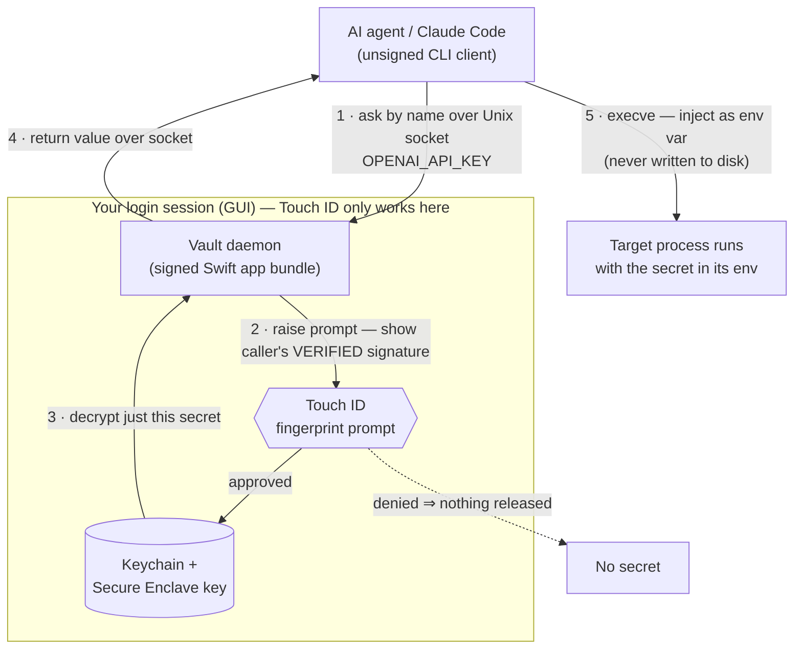

# 🔓 Sesame

> Open sesame — one key, one touch.

**Sesame** is a fingerprint-gated vault for your agent's environment secrets — one local, encrypted place for your API keys. When Claude Code (or any agent) needs a secret, it asks Sesame; you approve with **Touch ID**; the secret is handed over just for that run. You never paste it, and it never sits in plaintext.

This document is the product requirements document (PRD) for Sesame, distilled from the reviewed concept + build plan.

---

## 1 · Overview

Sesame is a small, local macOS tool that keeps every environment secret in one encrypted vault and releases each secret only after a fingerprint approval. It is built for AI coding agents: the agent requests a secret **by name**, you approve with **Touch ID**, and the value is injected into that single run — never pasted by hand, never written to disk in the clear, never synced off your Mac.

**Tagline:** *Open sesame — one key, one touch.*

---

## 2 · Problem

API keys and tokens are **scattered** — some in `.env` files, some pasted into chats, some in shell history. That is fragile and risky:

- Secrets end up in places that get shared, committed, or logged.
- Every time an agent needs one, you fish it out and paste it by hand.
- Password managers (Face ID / fingerprint) are built for *login* — an email + password you type into a website — not for **handing an environment variable to a program**.

The thing you actually want — "let my agent grab `OPENAI_API_KEY`, but make me approve it with my fingerprint, and keep it off my disk in plaintext" — no everyday password app does.

---

## 3 · Goals / Non-goals

### Goals

- **One vault** — a single, local, encrypted home for every env secret. No more scatter.
- **Fingerprint to release** — reading a secret requires your Touch ID. No fingerprint, no secret.
- **Agent-native** — Claude Code or any harness asks the vault by name and gets the value injected — no paste.
- **Never plaintext** — encrypted at rest; handed to the process only for that run; not left in shell history or on disk.

### Non-goals

- **Fully-headless / unattended Touch ID.** This is impossible on macOS by design (see [§9 · The hard constraint](#9--the-hard-constraint)). Sesame targets "you're at your Mac and approve with a tap," not a cron/SSH/daemon context with no login session.

---

## 4 · Ideal user flow

1. The agent needs `STRIPE_SECRET_KEY` and asks the vault for it (by name).
2. Your Mac pops a **Touch ID** prompt: *"Claude Code wants STRIPE_SECRET_KEY — approve?"* (the prompt names the requester).
3. You tap the sensor. The vault decrypts just that one secret.
4. The value is injected into the agent's environment **for that run only**.
5. Nothing was pasted, nothing was written to disk in the clear, and the grant is **logged**.

---

## 5 · Existing tools & the gap

Judged against Sesame's exact flow (*agent asks → Touch ID → env injected → local-only*):

| Tool | Touch ID | Env inject | Local-only | Verdict |
| --- | --- | --- | --- | --- |
| **Sesame** (this) | ✅ per-request | ✅ native (execve/FIFO) | ✅ Keychain, never synced | **Exactly our target — the tool we're building.** Free, local, per-request. |
| **1Password `op run`** | ✅ session (10 min) | ✅ native (FIFO, no disk) | ◐ cloud-synced | **Closest — but PAID.** $3.99/mo, no free tier (14-day trial). Session-based, not per-ask; cloud vault. Ruled out: you need free. |
| Keychain + `kSecAccessControlBiometryAny` | ✅ per-read | ✋ manual | ✅ yes | Right primitives, no env-inject layer. This is what we build on. |
| envchain | ✋ login pw only | ✅ native | ✅ yes | Local + inject, but Touch ID only in an experimental fork. |
| Secretive | ✅ | — | ✅ Secure Enclave | Design **precedent** (SSH keys in Secure Enclave), not for env secrets. |
| Vault / Doppler / Infisical | ❌ | ✅ | ◐ cloud | Token-based, no biometric gate. Team tools, wrong shape. |
| SOPS+age / pass / gopass | ❌ | — | ✅ | File encryption, no biometrics, no inject. |

**Verdict: a genuine gap.** Nothing does "an agent asks for a named secret → per-request Touch ID → injected → local-only." The nearest, `op run`, is session-cached and cloud-backed. Sesame fills the gap by building **free on the macOS Keychain**, which is local, per-read biometric, and already on your Mac.

---

## 6 · Architecture

A bare command-line tool **cannot** use the biometric / Secure-Enclave Keychain: that needs the restricted `keychain-access-groups` entitlement, which requires an Apple **provisioning profile** — issued only to signed **app bundles**, never to plain CLIs (a lone CLI hits `errSecMissingEntitlement` -34018).

So the shape is fixed — this is exactly the **Secretive model**:

- A **code-signed Swift daemon** (a small app bundle) owns the Keychain, the Secure-Enclave key, and raises the Touch ID prompt. It runs in your logged-in GUI session.
- An **unsigned CLI client** (what the agent calls) talks to the daemon over a **Unix-domain socket**, gets the secret back, and injects it via `execve`.

Swift is the pick: `LocalAuthentication` + `Security` are built-in, there is zero shipping cost, and Secretive proves the pattern.



---

## 7 · How it works

- **Keychain storage.** Each secret is a Keychain *generic-password* item created with a `SecAccessControl` (`.biometryCurrentSet`) and `kSecAttrAccessibleWhenUnlockedThisDeviceOnly` — so it stays local, never synced to iCloud, and invalidates if the enrolled fingerprints change.
- **Encrypt, not hash.** A **hash** is one-way — you can never get the original back — which is right for *checking* a login password but useless for a secret you must *use*. An API key must come back **byte-for-byte**, so the vault **encrypts** (two-way, reversible); it does **not** hash.
- **Touch ID authorizes, the Secure Enclave decrypts.** Your fingerprint does not unscramble anything itself. The secret is encrypted with a Secure-Enclave-backed key and stored in the Keychain; to read it, Touch ID **authorizes** the Enclave to use its key, the Enclave **decrypts** inside the chip, and your agent gets the real value. Your fingerprint data never leaves the chip and is never the encryption key. Even malware that reads your disk gets only the scrambled blob.
- **Blast radius = one key.** Because each secret is its own Keychain item, a read returns **only that secret** and triggers **its own** prompt — the OS forces a separate Touch ID even for rapid back-to-back reads of different items. A grant for `OPENAI_API_KEY` can't also hand over `STRIPE_SECRET_KEY`.
- **Injection, never on disk.** A wrapper (`vault run -- <cmd>`) hands approved secrets to the child process via its **environment** (`execve`) — never a temp `.env` file. The strongest version copies `op run`'s **FIFO / named-pipe** trick so no plaintext file ever exists on disk.
- **Open but never blind.** Access policy is OPEN (see [§8](#8--decisions)): any process may ask. To keep that safe, the daemon **verifies the caller's code signature** and shows it in the prompt (an impostor can't fake being `claude-code`), **rate-limits** repeat prompts, and **logs every request** (approved or denied).

---

## 8 · Decisions

Four decisions are locked.

| Decision | Choice | Why |
| --- | --- | --- |
| **Storage** | Keychain item backed by the **Secure Enclave** | Local, hardware-gated, never synced. Built into macOS — no hand-rolled crypto. |
| **Grant granularity** | **Least privilege** — one tap = one key | Per-secret Keychain items mean a fingerprint releases only the requested secret; every other key stays locked and needs its own tap. Looser grouping/reuse-windows are opt-in, not the default. |
| **Build vs buy** | **Build free on the Keychain** | The closest bought option, 1Password `op run`, is $3.99/mo with no free tier — ruled out. The Keychain gives the same fingerprint gate at $0, already on your Mac. |
| **Access policy** | **OPEN** — any process may ask; your fingerprint is the only gate | Safe by default (nothing releases without your tap). Safeguards keep it from being blind: the prompt shows the caller's **verified code signature**, repeat prompts are **rate-limited**, and every request is **logged**. |

---

## 9 · The hard constraint

**A truly headless agent cannot raise a Touch ID prompt.** Per Apple's own docs, macOS `LocalAuthentication` is "intended to be used from a user login context, not from the global context in which launchd daemons run." A process from cron, SSH, or a background daemon gets *"Can't show UI while not in a console session."*

This is the make-or-break constraint, and it shapes the whole design: the vault must run in your **logged-in GUI session** and owns the Touch ID prompt. Agents don't prompt — they *ask the vault*, and the vault raises the fingerprint prompt on your screen.

Bottom line: **fully-unattended fingerprint gating is impossible on macOS by design.** "You're at your Mac and approve with a tap" is very possible — and it matches how you actually work with an agent.

---

## 10 · Build tiers & roadmap

Two tiers, because the strongest one carries a small cost.

| Tier | What you get | Cost |
| --- | --- | --- |
| **Free MVP** (first) | Touch ID gate via `LAContext.evaluatePolicy` (this **does** work from an **unsigned** tool) + secrets encrypted in the plain login Keychain / a file. Fingerprint-gated, local, no hardware binding. | **$0** — no Apple Developer account |
| **Hardened** (later) | Secrets bound to the **Secure Enclave** via a **signed daemon** + SE key-wrap — the strongest version, explicit hardware binding. | Needs an Apple Developer account for a real provisioning profile (~$99/yr) |

**Plan:** prototype the Free MVP first — it is genuinely $0 and proves the flow. Graduate to the hardened Secure-Enclave tier only if the hardware binding is worth the dev-account fee.

---

## 11 · Platform

macOS on **Apple Silicon** — Touch ID (the fingerprint gate) and the **Secure Enclave** (a separate security chip that holds keys the main OS can't read). Sesame builds on the platform's own biometric grant, the same one that unlocks your Mac, so there is no separate password to manage.

---

## 12 · Open items & next steps

- **Trademark + domain.** Run a real trademark search and grab a domain/handle (e.g. `sesame.app` / `getsesame.app`). Sesame is not affiliated with any other product of the same name.
- **Free-MVP technical design.** Write the one-page technical design for the Free MVP (unsigned CLI + `LAContext` gate + login-Keychain storage), then a prototype behind Touch ID.

---

## 13 · Usage (Free MVP — Milestone 1)

The Free MVP is a single **unsigned** SwiftPM command-line tool. macOS 13+, Apple Silicon.

### ⚠️ Security note — the MVP Touch ID gate is advisory, not hardware-enforced

**Read this before you trust the MVP with anything sensitive.** In the Free MVP the Touch ID prompt is raised at the **CLI layer** (`LAContext.evaluatePolicy`) *before* Sesame reads the secret. The secret itself lives in a **plain login-Keychain item** (`kSecClassGenericPassword`, `kSecAttrAccessibleWhenUnlockedThisDeviceOnly`) with **no biometric `SecAccessControl`** — because a biometric/Secure-Enclave access control needs the restricted Keychain entitlement, which a bare CLI cannot have.

The consequence, stated plainly: **the fingerprint is a user-facing courtesy gate, not a cryptographic binding.** Any other process running as you, in a login session, can read that Keychain item directly and never see a Touch ID prompt. Sesame's gate stops *Sesame* from releasing the value without your tap; it does **not** stop a determined same-user program from going around Sesame. Likewise the access log's `requester` is a **best-effort parent-process name** (spoofable by renaming a binary), **not** a verified code signature.

This is the accepted, documented tradeoff for the **$0 tier**. **Milestone 2** (a code-signed daemon + a **Secure-Enclave** key-wrap + a Unix-socket ask-interface with the caller's **verified code signature**) makes the gate cryptographic and closes these gaps. Do not treat the MVP as hardware-bound.

`run`'s env injection is also visible to same-user tooling (`ps -E`, a debugger) while the child runs — no plaintext ever hits disk, but the environment is not hidden. Milestone 2 switches to a FIFO/named-pipe (`op run` model) to remove even that.

### Build & install

```
swift build -c release
cp .build/release/sesame /usr/local/bin/sesame   # or anywhere on your PATH
```

### Commands

Sesame prints **TOON** by default (a compact, agent-friendly shape); every command also takes `--json`. Secret **values never** appear in `--json`, in the log, or in `argv`.

| Command | What it does |
| --- | --- |
| `sesame` | No-args dashboard: recent secrets + `summary: total: N` + next-step hints. |
| `sesame add <NAME>` | Store a secret. **Value is read from STDIN** (never argv, so it can't leak via `ps`). Re-adding an existing name is a safe no-op → `already: true`. |
| `sesame get <NAME>` | Touch ID → the **bare value on STDOUT only** (for `$(…)`); metadata to STDERR. `--json` omits the value. |
| `sesame run <NAME…> -- <cmd>` | Touch ID **once per secret** → inject into `<cmd>`'s environment via `execve` → run it (stdout/exit passed through). |
| `sesame ls [--full]` | List secret names + metadata (never values). Empty: `secrets[0]: (none added yet)`. |
| `sesame rm <NAME> --confirm` | Delete a secret. **Requires `--confirm` (or `--force`)** — deletion is permanent. |
| `sesame log [--limit N] [--since T] [--full]` | Show the access log, newest-first. |

Global flags: `--json` (all commands), `--full` (more fields / untruncated), `--help` (per command), `-v` / `--version`.

### Examples

```
# Store a key — the value comes from stdin, never the command line.
printf '%s' "$OPENAI_API_KEY" | sesame add OPENAI_API_KEY

# Use it in a subshell (Touch ID prompt appears; bare value on stdout).
export OPENAI_API_KEY="$(sesame get OPENAI_API_KEY)"

# Run a command with one or more secrets injected (one tap per secret).
sesame run OPENAI_API_KEY STRIPE_SECRET_KEY -- ./deploy.sh

# See what you have, and the access trail.
sesame ls
sesame log --limit 20
```

### Exit codes

`0` success · `1` runtime failure (Touch ID denied, rate-limited, I/O, Keychain locked) · `2` usage error (secret not found, bad name, missing `--confirm`).

### Storage & log locations

- **Secrets:** login Keychain, service `dev.sesame`, one generic-password item per secret, `ThisDeviceOnly` (never synced to iCloud).
- **Access log:** JSON-Lines at `~/Library/Application Support/Sesame/access.log` — one record per request `{ts, op, name, requester, result}`, never the value.

### Rate limiting

Repeated reads of the *same* secret are throttled to **5 reads / 60 s** (in-memory, per process). On exceed: `error: rate-limited for <NAME> — try again in <Xs>` (exit 1), logged as `result:"ratelimited"`.

### Testing note

`swift test` runs headlessly: the Touch ID gate is behind an `Authenticator` protocol so unit tests use a **fake** that approves/denies with no prompt, and the Keychain tests use an isolated `dev.sesame.test` service and **skip cleanly** when no login Keychain is available (CI/non-mac). The **real** Touch ID prompt can only be exercised interactively on a Mac — that prove-out is manual.

---

## 14 · Milestone 2 · Stage A — windowed app + auto-start

Stage A turns the CLI into a **visible, windowed macOS app** (a **Dock icon** and a **main window**) that **auto-starts at login**. It is a front-end + auto-start over the exact same login-Keychain storage Milestone 1 uses (service `dev.sesame`) — the **security model is unchanged and still advisory** (see [§13's security note](#13--usage-free-mvp--milestone-1)). Stage B (Secure-Enclave key-wrap, a signed/notarized build, the socket/XPC ask-interface) is a separate later task and is **not** in Stage A.

### What ships

- A **`SesameCore`** SwiftPM library shared by the `sesame` CLI and the app (storage, log, model, and the Touch ID gate — no logic duplication).
- A **`SesameApp`** executable: a **normal windowed macOS app** (macOS 13+) — `LSUIElement=false` and `NSApp.setActivationPolicy(.regular)`, so it gets a **Dock icon**, a standard menu bar, and a **main window that opens on launch**. A SwiftUI `WindowGroup` titled **"Sesame"** presents three panes (segmented): **Secrets** (search + per-secret rows showing the key name and a humanized "used X ago · requester", with reveal/copy and remove), an **Access Log** table (time · secret · requester · result, newest first), and **Settings** (auto-start toggle + active storage backend + running indicator). Reveal/copy is Touch ID-gated, copies the value to the clipboard, and never renders or logs it.
- A **secondary `NSStatusItem`** menu-bar item remains as quick-access — clicking it re-focuses the window. The **window is the primary UI**: a status-bar-only design left nothing visible on notched MacBooks (the icon hides behind the notch), so a window + Dock icon is the reliable, always-visible fix.
- **Auto-start at login** via `SMAppService.mainApp`, wired to a Settings toggle that reflects the real `.status`.

### Build & install the app

```
scripts/build-app.sh      # or: make app
open ~/Applications/Sesame.app
```

`build-app.sh` does `swift build -c release`, assembles `Sesame.app/Contents/{MacOS/Sesame, Info.plist, Resources}` (Info.plist: `LSUIElement=false` — Dock icon + window, `CFBundleIdentifier=dev.sesame.app`, `LSMinimumSystemVersion=13.0`), **ad-hoc code-signs** it (`codesign -s - --force --deep` — no Apple Developer account needed for Stage A), and **installs to `~/Applications/Sesame.app`**. Installing there is **required**: `SMAppService` discovers `mainApp` login items reliably only in `~/Applications` or `/Applications` — a `.app` left in `.build/` will **not** auto-launch at login.

### Auto-start caveats (honored + surfaced in the UI)

- **Registered ≠ launched now.** `SMAppService.mainApp.register()` succeeding means *registered*; the app actually launches at login only after the **next login/reboot**.
- **First toggle may need approval.** The first registration can raise a macOS **"Allow in Login Items"** prompt (status `.requiresApproval`); you must click **Allow** — it cannot be automated.
- **Location matters.** Auto-start only works because the `.app` is installed in `~/Applications` (above).

### Touch ID in the app

Listing secret **names needs no Touch ID** (names are not values). Touch ID (via `LAAuthenticator`) is raised on **Remove** and on **Reveal/Copy** (releasing a value stamps the real `lastUsedAt`/`lastUsedBy` shown in the row). The app runs in your GUI login session, so `LAContext` works. Same advisory model as the CLI; Stage B makes it cryptographic.

### Manual prove-out (the window UI + biometrics can't run headless)

1. Run `scripts/build-app.sh`, then `open ~/Applications/Sesame.app`.
2. A **Dock icon appears** and the **"Sesame" window opens on launch** and comes to the front (a status-bar item is also added as quick-access; clicking it re-focuses the window).
3. The **Secrets** pane shows a **"Running"** indicator, a search field, and the secrets list (names from service `dev.sesame`, no values) with a "used X ago · requester" line per row, plus reveal/copy and remove.
4. **Add** a test secret (＋ → name + value) → the list updates. **Reveal/Copy** it → **Touch ID prompt** → approve → the value is on the clipboard (never shown) and the row's "used X ago" refreshes. **Remove** it → **Touch ID prompt** → approve → it's gone.
5. The **Access Log** pane lists time · secret · requester · result (newest first).
6. In **Settings**, toggle **Start at login** ON → it reflects `SMAppService` status `enabled` and appears in **System Settings → General → Login Items**. (Launches at login only after the next login/reboot; the first toggle may raise the "Allow in Login Items" prompt — click Allow.)

### Human-only steps (not automatable)

- Clicking **Allow** on the macOS Login Items approval prompt.
- The manual UI + Touch ID prove-out above.
- (Not needed for Stage A — a proper Developer-ID signing team is a Stage B concern.)

---

## 15 · Milestone 2 · Stage B — Secure-Enclave gate + agent socket + CLI-as-client

Stage B turns the **advisory** gate into a **cryptographic** one and makes the signed windowed app the **agent** the `sesame` CLI talks to (the [Secretive](https://github.com/maxgoedjen/secretive) model). Each secret is now **ECIES-wrapped to a Secure-Enclave key** whose private half never leaves the chip and only decrypts after Touch ID — reading the stored blob directly yields ciphertext. **Defaults are unchanged**: a fresh install still behaves exactly like Stage A until you produce a signed build and flip the backend, so nothing regresses.

### Architecture

- The **signed app is the agent**: it owns the SE key, raises Touch ID, and listens on a Unix-domain socket in your login session (Touch ID only works there).
- The **`sesame` CLI is a thin client**: `get`/`run`/`add`/`ls`/`rm` route to the agent over the socket; the agent SE-decrypts behind Touch ID and returns the value, which the CLI injects via `execve` exactly as before. If the agent is down, the CLI **fails safe** to the Stage-A advisory local path — never crashes.

### Configuration (`~/Library/Application Support/Sesame/config.json`)

| Key | Values | Default | Meaning |
| --- | --- | --- | --- |
| `storage_backend` | `advisory` \| `secure-enclave` | `advisory` | Where secrets live. `advisory` = Stage-A login-Keychain; `secure-enclave` = the cryptographic file vault. |
| `data_source` | `agent` \| `local` | `agent` | How the CLI reaches the store. `agent` routes through the socket **and fails safe to advisory-local when no agent is running** — so the default = Stage-A behavior. |
| `agent_socket` | path | `…/Sesame/agent.sock` | The agent's listen/connect socket. |

**To go cryptographic:** produce a signed build (below), set `storage_backend` to `secure-enclave`, relaunch the app, then `sesame migrate`.

### The Secure-Enclave key (pinned choices)

- **Key:** a per-vault EC key created with `SecKeyCreateRandomKey` on `kSecAttrTokenIDSecureEnclave`, with a biometric `SecAccessControl` of `.privateKeyUsage` + **`.biometryAny`**. `.biometryAny` (not `.biometryCurrentSet`) is deliberate — this is a *vault*, so **durability beats strictness**: `.biometryCurrentSet` would invalidate the key (and destroy every secret) whenever you add or remove a fingerprint. `.biometryAny` survives enrollment changes, still requires an enrolled fingerprint, and stays device-bound + non-exportable.
- **No `keychain-access-groups` entitlement.** The SE key is a keychain token item under the app's **own** default access group; a signed app reaches its own items with no special (paid/restricted) entitlement. This is why Secretive needs none either.
- **Blob = file, not keychain.** Each wrapped secret is a file `~/Library/Application Support/Sesame/vault/<name>.bin` (`0600`, dir `0700`), with a `<name>.meta` sidecar for timestamps (never the value). Storing ciphertext as a file avoids the keychain-entitlement path entirely.

### Recovery — SE keys can't be backed up

An SE key is per-device and non-exportable: an **OS reinstall / device loss / Enclave reset means the SE-wrapped secrets are gone** (`.biometryAny` prevents loss on fingerprint changes, but not on device loss). So **SE-backed secrets live only on this Mac** — there is no hidden second copy (that would defeat the gate). Your backup story is explicit and user-controlled:

| Command | What it does |
| --- | --- |
| `sesame migrate` | Re-wrap each advisory (Stage-A) secret into the SE vault (Touch ID per secret). On any failure the advisory copy is **left intact**; drop old copies afterward with `sesame rm <NAME> --advisory --confirm`. No silent auto-migrate. |
| `sesame export` | Dump every secret as `NAME=value` on STDOUT (Touch ID per secret) — a backup **you** store and protect. `sesame export > vault.env` then guard that file. |
| `sesame import` | Restore `NAME=value` lines from STDIN into a fresh vault (`sesame import < vault.env`). Idempotent — an existing name is skipped. |

### Agent socket protocol

- **Framing:** a **uint32 big-endian length prefix**, then a **JSON** object. One request, one response, per connection.
- **Request:** `{op, name?, value?, requester?}` where `op` ∈ `get` \| `list` \| `add` \| `delete`. **Response:** `{ok, value?, error?, secrets?, requesterSignature?}`.
- **Serialized Touch ID:** the agent raises **one prompt at a time**; concurrent `get`s queue, each with a **60 s timeout** → `{ok:false,error:"timeout"}`.

### Peer verification + the OPEN policy

Access policy is **OPEN** — any same-user process may connect and ask; the **fingerprint is the gate**, not an allow-list. To keep that safe, the agent reads the connecting peer's PID (`LOCAL_PEERPID`) and derives its **verified code signature** (`SecCodeCopyGuestWithAttributes` by pid → `SecCodeCopySigningInformation`), then **shows it in the Touch ID prompt and logs it**:

- **signed** → the verified code-signing identifier (an impostor can't fake being `claude-code`).
- **unsigned** → flagged `unsigned:<path>:<pid>` — **allowed but clearly flagged**, never silently trusted, never auto-approved.

### Signing + the one human-only step

The SE gate **requires a real Apple Developer signing identity** — an ad-hoc signature cannot carry the entitlement, so `SecKeyCreateRandomKey` on the Enclave fails with `errSecMissingEntitlement` (-34018). Everything else (the whole store/agent/client logic) is built and unit-tested headlessly against a fake Enclave; only the real encrypt/decrypt + Touch ID need your signed build.

`Sesame.entitlements` is **minimal** (pinned): Hardened Runtime (via `codesign -o runtime`), **not** sandboxed (`com.apple.security.app-sandbox = false` — the agent writes to Application Support and opens a socket), and **no** `keychain-access-groups`.

```
# 1. Build + install a SIGNED agent (your Developer identity is the one human input):
SESAME_SIGN_ID="Developer ID Application: Your Name (TEAMID)" bash scripts/build-app.sh

# 2. Confirm the identity + entitlements landed:
codesign -dv --entitlements - ~/Applications/Sesame.app
#   expect your Team ID, the runtime flag, and app-sandbox = false

# 3. Turn on the SE backend, relaunch the app so the agent owns the SE store:
open ~/Applications/Sesame.app
#   set "storage_backend": "secure-enclave" in config.json (data_source stays "agent"), relaunch

# 4. Migrate + PROVE the gate is cryptographic:
sesame migrate                       # re-wraps advisory secrets (Touch ID per secret)
sesame get SOME_SECRET               # the APP's Touch ID prompt fires, then the value prints
xxd ~/Library/Application\ Support/Sesame/vault/SOME_SECRET.bin | head
#   ^ ciphertext (garbage) — proof the on-disk blob is encrypted, not the value
sesame run SOME_SECRET -- printenv SOME_SECRET   # injected into the child's env

# 5. After verifying, drop the old advisory copies:
sesame rm SOME_SECRET --advisory --confirm
```

Without `SESAME_SIGN_ID`, `build-app.sh` falls back to an ad-hoc signature (Stage-A advisory behavior) and prints that the SE gate needs a real identity.

### Testing note (Stage B)

`swift test` stays fully headless: a **fake Enclave provider** models the real API (ECIES round-trip, throws on an invalidated/absent key, serializes concurrent access, deny-path), so the SE store, agent socket (real AF_UNIX round-trip in-process), CLI-as-client routing, agent-down fallback, concurrency + timeout, and unsigned-peer flagging are all covered. The **real** Secure-Enclave test **skips cleanly** without a signed + entitled build.
