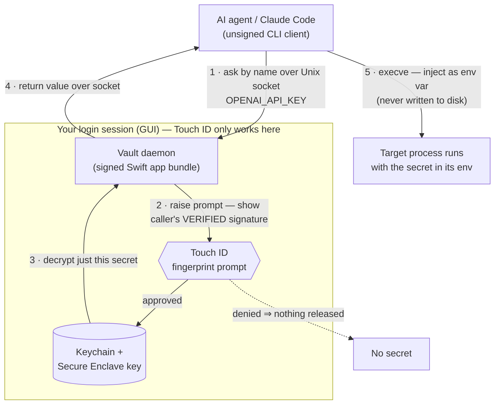

# 🔓 Sesame

> Open sesame — one key, one touch.

**Sesame** is a fingerprint-gated vault for your agent's environment secrets — one local, encrypted place for your API keys. When Claude Code (or any agent) needs a secret, it asks Sesame; you approve with **Touch ID**; the secret is handed over just for that run. You never paste it, and it never sits in plaintext.

This document is the product requirements document (PRD) for Sesame, distilled from the reviewed concept + build plan.

---

## 1 · Overview

Sesame is a small, local macOS tool that keeps every environment secret in one encrypted vault and releases each secret only after a fingerprint approval. It is built for AI coding agents: the agent requests a secret **by name**, you approve with **Touch ID**, and the value is injected into that single run — never pasted by hand, never written to disk in the clear, never synced off your Mac.

**Tagline:** *Open sesame — one key, one touch.*

---

## 2 · Problem

API keys and tokens are **scattered** — some in `.env` files, some pasted into chats, some in shell history. That is fragile and risky:

- Secrets end up in places that get shared, committed, or logged.
- Every time an agent needs one, you fish it out and paste it by hand.
- Password managers (Face ID / fingerprint) are built for *login* — an email + password you type into a website — not for **handing an environment variable to a program**.

The thing you actually want — "let my agent grab `OPENAI_API_KEY`, but make me approve it with my fingerprint, and keep it off my disk in plaintext" — no everyday password app does.

---

## 3 · Goals / Non-goals

### Goals

- **One vault** — a single, local, encrypted home for every env secret. No more scatter.
- **Fingerprint to release** — reading a secret requires your Touch ID. No fingerprint, no secret.
- **Agent-native** — Claude Code or any harness asks the vault by name and gets the value injected — no paste.
- **Never plaintext** — encrypted at rest; handed to the process only for that run; not left in shell history or on disk.

### Non-goals

- **Fully-headless / unattended Touch ID.** This is impossible on macOS by design (see [§9 · The hard constraint](#9--the-hard-constraint)). Sesame targets "you're at your Mac and approve with a tap," not a cron/SSH/daemon context with no login session.

---

## 4 · Ideal user flow

1. The agent needs `STRIPE_SECRET_KEY` and asks the vault for it (by name).
2. Your Mac pops a **Touch ID** prompt: *"Claude Code wants STRIPE_SECRET_KEY — approve?"* (the prompt names the requester).
3. You tap the sensor. The vault decrypts just that one secret.
4. The value is injected into the agent's environment **for that run only**.
5. Nothing was pasted, nothing was written to disk in the clear, and the grant is **logged**.

---

## 5 · Existing tools & the gap

Judged against Sesame's exact flow (*agent asks → Touch ID → env injected → local-only*):

| Tool | Touch ID | Env inject | Local-only | Verdict |
| --- | --- | --- | --- | --- |
| **Sesame** (this) | ✅ per-request | ✅ native (execve/FIFO) | ✅ Keychain, never synced | **Exactly our target — the tool we're building.** Free, local, per-request. |
| **1Password `op run`** | ✅ session (10 min) | ✅ native (FIFO, no disk) | ◐ cloud-synced | **Closest — but PAID.** $3.99/mo, no free tier (14-day trial). Session-based, not per-ask; cloud vault. Ruled out: you need free. |
| Keychain + `kSecAccessControlBiometryAny` | ✅ per-read | ✋ manual | ✅ yes | Right primitives, no env-inject layer. This is what we build on. |
| envchain | ✋ login pw only | ✅ native | ✅ yes | Local + inject, but Touch ID only in an experimental fork. |
| Secretive | ✅ | — | ✅ Secure Enclave | Design **precedent** (SSH keys in Secure Enclave), not for env secrets. |
| Vault / Doppler / Infisical | ❌ | ✅ | ◐ cloud | Token-based, no biometric gate. Team tools, wrong shape. |
| SOPS+age / pass / gopass | ❌ | — | ✅ | File encryption, no biometrics, no inject. |

**Verdict: a genuine gap.** Nothing does "an agent asks for a named secret → per-request Touch ID → injected → local-only." The nearest, `op run`, is session-cached and cloud-backed. Sesame fills the gap by building **free on the macOS Keychain**, which is local, per-read biometric, and already on your Mac.

---

## 6 · Architecture

A bare command-line tool **cannot** use the biometric / Secure-Enclave Keychain: that needs the restricted `keychain-access-groups` entitlement, which requires an Apple **provisioning profile** — issued only to signed **app bundles**, never to plain CLIs (a lone CLI hits `errSecMissingEntitlement` -34018).

So the shape is fixed — this is exactly the **Secretive model**:

- A **code-signed Swift daemon** (a small app bundle) owns the Keychain, the Secure-Enclave key, and raises the Touch ID prompt. It runs in your logged-in GUI session.
- An **unsigned CLI client** (what the agent calls) talks to the daemon over a **Unix-domain socket**, gets the secret back, and injects it via `execve`.

Swift is the pick: `LocalAuthentication` + `Security` are built-in, there is zero shipping cost, and Secretive proves the pattern.

---

## 7 · How it works

- **Keychain storage.** Each secret is a Keychain *generic-password* item created with a `SecAccessControl` (`.biometryCurrentSet`) and `kSecAttrAccessibleWhenUnlockedThisDeviceOnly` — so it stays local, never synced to iCloud, and invalidates if the enrolled fingerprints change.
- **Encrypt, not hash.** A **hash** is one-way — you can never get the original back — which is right for *checking* a login password but useless for a secret you must *use*. An API key must come back **byte-for-byte**, so the vault **encrypts** (two-way, reversible); it does **not** hash.
- **Touch ID authorizes, the Secure Enclave decrypts.** Your fingerprint does not unscramble anything itself. The secret is encrypted with a Secure-Enclave-backed key and stored in the Keychain; to read it, Touch ID **authorizes** the Enclave to use its key, the Enclave **decrypts** inside the chip, and your agent gets the real value. Your fingerprint data never leaves the chip and is never the encryption key. Even malware that reads your disk gets only the scrambled blob.
- **Blast radius = one key.** Because each secret is its own Keychain item, a read returns **only that secret** and triggers **its own** prompt — the OS forces a separate Touch ID even for rapid back-to-back reads of different items. A grant for `OPENAI_API_KEY` can't also hand over `STRIPE_SECRET_KEY`.
- **Injection, never on disk.** A wrapper (`vault run -- <cmd>`) hands approved secrets to the child process via its **environment** (`execve`) — never a temp `.env` file. The strongest version copies `op run`'s **FIFO / named-pipe** trick so no plaintext file ever exists on disk.
- **Open but never blind.** Access policy is OPEN (see [§8](#8--decisions)): any process may ask. To keep that safe, the daemon **verifies the caller's code signature** and shows it in the prompt (an impostor can't fake being `claude-code`), **rate-limits** repeat prompts, and **logs every request** (approved or denied).

---

## 8 · Decisions

Four decisions are locked.

| Decision | Choice | Why |
| --- | --- | --- |
| **Storage** | Keychain item backed by the **Secure Enclave** | Local, hardware-gated, never synced. Built into macOS — no hand-rolled crypto. |
| **Grant granularity** | **Least privilege** — one tap = one key | Per-secret Keychain items mean a fingerprint releases only the requested secret; every other key stays locked and needs its own tap. Looser grouping/reuse-windows are opt-in, not the default. |
| **Build vs buy** | **Build free on the Keychain** | The closest bought option, 1Password `op run`, is $3.99/mo with no free tier — ruled out. The Keychain gives the same fingerprint gate at $0, already on your Mac. |
| **Access policy** | **OPEN** — any process may ask; your fingerprint is the only gate | Safe by default (nothing releases without your tap). Safeguards keep it from being blind: the prompt shows the caller's **verified code signature**, repeat prompts are **rate-limited**, and every request is **logged**. |

---

## 9 · The hard constraint

**A truly headless agent cannot raise a Touch ID prompt.** Per Apple's own docs, macOS `LocalAuthentication` is "intended to be used from a user login context, not from the global context in which launchd daemons run." A process from cron, SSH, or a background daemon gets *"Can't show UI while not in a console session."*

This is the make-or-break constraint, and it shapes the whole design: the vault must run in your **logged-in GUI session** and owns the Touch ID prompt. Agents don't prompt — they *ask the vault*, and the vault raises the fingerprint prompt on your screen.

Bottom line: **fully-unattended fingerprint gating is impossible on macOS by design.** "You're at your Mac and approve with a tap" is very possible — and it matches how you actually work with an agent.

---

## 10 · Build tiers & roadmap

Two tiers, because the strongest one carries a small cost.

| Tier | What you get | Cost |
| --- | --- | --- |
| **Free MVP** (first) | Touch ID gate via `LAContext.evaluatePolicy` (this **does** work from an **unsigned** tool) + secrets encrypted in the plain login Keychain / a file. Fingerprint-gated, local, no hardware binding. | **$0** — no Apple Developer account |
| **Hardened** (later) | Secrets bound to the **Secure Enclave** via a **signed daemon** + SE key-wrap — the strongest version, explicit hardware binding. | Needs an Apple Developer account for a real provisioning profile (~$99/yr) |

**Plan:** prototype the Free MVP first — it is genuinely $0 and proves the flow. Graduate to the hardened Secure-Enclave tier only if the hardware binding is worth the dev-account fee.

---

## 11 · Platform

macOS on **Apple Silicon** — Touch ID (the fingerprint gate) and the **Secure Enclave** (a separate security chip that holds keys the main OS can't read). Sesame builds on the platform's own biometric grant, the same one that unlocks your Mac, so there is no separate password to manage.

---

## 12 · Open items & next steps

- **Trademark + domain.** Run a real trademark search and grab a domain/handle (e.g. `sesame.app` / `getsesame.app`). Sesame is not affiliated with any other product of the same name.
- **Free-MVP technical design.** Write the one-page technical design for the Free MVP (unsigned CLI + `LAContext` gate + login-Keychain storage), then a prototype behind Touch ID.
